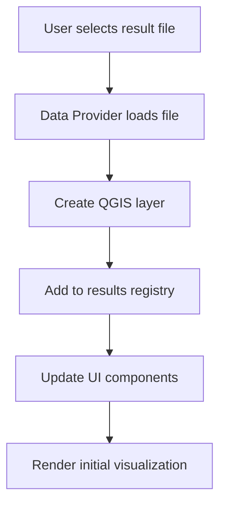

# Plugin Architecture and Core Components

## Overview

The QGIS-CoastalME-Plugin follows a modular architecture with clear separation between data handling, visualization, and user interface components. This document details the core architecture and how the components work together.

## High-Level Architecture

```
┌─────────────────────────────────────────────────────────────────┐
│                    QGIS Interface Layer                        │
├─────────────────────────────────────────────────────────────────┤
│                     Plugin Entry Point                         │
│                  coastalmeqgis_menu.py                         │
├─────────────────────────────────────────────────────────────────┤
│                   Main Components                              │
│  ┌─────────────────┐  ┌─────────────────┐  ┌─────────────────┐ │
│  │   Results       │  │   Viewer        │  │   Algorithms    │ │
│  │   Management    │  │   System        │  │   & Tools       │ │
│  └─────────────────┘  └─────────────────┘  └─────────────────┘ │
├─────────────────────────────────────────────────────────────────┤
│                   Data Providers                               │
│  ┌─────────────────┐  ┌─────────────────┐  ┌─────────────────┐ │
│  │   2D Results    │  │   1D Results    │  │   Particles     │ │
│  │   (.xmdf, .dat) │  │   (.tpc, .csv)  │  │   (.nc)         │ │
│  └─────────────────┘  └─────────────────┘  └─────────────────┘ │
├─────────────────────────────────────────────────────────────────┤
│                   File System & External                       │
│                    Libraries (matplotlib)                      │
└─────────────────────────────────────────────────────────────────┘
```

## Core Components

### 1. Plugin Entry Point (`coastalmeqgis_menu.py`)

The main plugin class that coordinates all functionality:

```python
class coastalmeqgis_menu:
    def __init__(self, iface):
        self.iface = iface
        self.actions = []
        self.menu = 'COASTALME'
        self.toolbar = None
        
    def initGui(self):
        # Create menus and toolbars
        # Initialize dock widgets
        # Connect signals
        
    def unload(self):
        # Clean up resources
        # Remove UI elements
```

**Key Responsibilities:**
- Plugin initialization and cleanup
- Menu and toolbar creation
- Integration with QGIS interface
- Signal connection management

### 2. Results Viewer System (`coastalmeqgis_tuviewer/`)

The heart of the plugin - a comprehensive results visualization system:

#### Main Viewer (`coastalmeqgis_tuview.py`)
```python
class TuView(QDockWidget):
    def __init__(self):
        # Initialize UI components
        # Create results management
        # Set up plotting system
        
    def resultsChanged(self):
        # Handle result selection changes
        # Update visualization
        
    def timeSliderChanged(self):
        # Handle time step changes
        # Update maps and plots
```

**Key Features:**
- Dockable interface panel
- Time slider control
- Result type selection
- Layer management
- Plot integration

#### Results Management (`coastalmeqgis_turesults.py`)
```python
class TuResults:
    def __init__(self):
        self.results = {}           # All loaded results
        self.activeResults = []     # Currently selected results
        self.activeTime = None      # Current time step
        self.tuResults2D = None     # 2D results handler
        self.tuResults1D = None     # 1D results handler
        
    def updateActiveResultTypes(self):
        # Update what result types are shown
        
    def updateActiveTime(self):
        # Update current time step
```

**Key Responsibilities:**
- Centralized result tracking
- Time management
- Result type coordination
- Layer state management

### 3. Data Providers

#### 2D Results (`coastalmeqgis_turesults2d.py`)
Handles mesh-based results (flood depths, velocities, etc.):

```python
class TuResults2D:
    def __init__(self):
        self.results2d = {}          # 2D result datasets
        self.activeMeshLayers = []   # Currently active mesh layers
        self.activeScalar = None     # Current scalar dataset
        self.activeVector = None     # Current vector dataset
        
    def loadOpenMeshLayers(self):
        # Load mesh layers into QGIS
        
    def renderMap(self):
        # Update map visualization
```

**Data Types Handled:**
- Mesh layers (`.2dm` files)
- Result datasets (`.xmdf`, `.dat`, `.sup`)
- Time-varying mesh data
- Scalar and vector results

#### 1D Results (`coastalmeqgis_turesults1d.py`)
Handles network-based results (channel flows, node levels):

```python
class TuResults1D:
    def __init__(self):
        self.results1d = {}          # 1D result datasets
        self.activeType = None       # Current geometry type
        self.selectedResults = []    # Selected features
        
    def loadTSResults(self):
        # Load time series results
        
    def plot1dResults(self):
        # Update 1D plots
```

**Data Types Handled:**
- Time series data (`.tpc` files)
- Network geometries (channels, nodes)
- Cross-section data
- Hydraulic properties

#### Particles (`coastalmeqgis_turesultsParticles.py`)
Handles particle tracking results:

```python
class TuResultsParticles:
    def __init__(self):
        self.resultsParticles = {}   # Particle datasets
        
    def loadParticles(self):
        # Load particle data from NetCDF
        
    def updateActiveTime(self):
        # Update particle positions for current time
```

### 4. Plotting System (`coastalmeqgis_tuplot.py`)

Matplotlib integration for creating plots:

```python
class TuPlot:
    def __init__(self):
        self.TimeSeries = 0          # Time series plot type
        self.CrossSection = 1        # Cross-section plot type
        self.VerticalProfile = 2     # Vertical profile plot type
        
    def drawPlot(self, plotType, data):
        # Draw plot using matplotlib
        
    def updateCurrentPlot(self):
        # Refresh current plot
```

**Plot Types:**
- Time series plots
- Cross-section plots
- Long profile plots
- Vertical profile plots
- 3D surface plots

### 5. Algorithm Framework (`alg/`)

Processing algorithms that appear in QGIS toolbox:

```python
class CoastalMEAlgorithm(QgsProcessingAlgorithm):
    def processAlgorithm(self, parameters, context, feedback):
        # Algorithm implementation
        return {}
```

**Algorithm Categories:**
- Model setup tools
- Data conversion utilities
- Geometry creation tools
- Import/export functions

## Data Flow

### 1. Result Loading Process



### 2. Time Step Update Process

```mermaid
graph TD
    A[User changes time slider] --> B[TuResults.updateActiveTime()]
    B --> C[Update 2D mesh datasets]
    C --> D[Update 1D plot data]
    D --> E[Update particle positions]
    E --> F[Refresh map and plots]
```

### 3. Result Type Selection

```mermaid
graph TD
    A[User selects result type] --> B[TuResults.updateActiveResultTypes()]
    B --> C[Update mesh layer styling]
    C --> D[Update plot data series]
    D --> E[Refresh visualizations]
```

## Key Design Patterns

### 1. Observer Pattern
The plugin uses Qt's signal/slot system extensively:

```python
# Results changed signal
self.OpenResults.itemSelectionChanged.connect(self.resultsChanged)

# Time changed signal
self.cboTime.currentIndexChanged.connect(self.timeSliderChanged)

# Layer changed signal
self.iface.currentLayerChanged.connect(self.currentLayerChanged)
```

### 2. Factory Pattern
Data providers are created based on file type:

```python
def createDataProvider(filename):
    if filename.endswith('.xmdf'):
        return XMDFDataProvider(filename)
    elif filename.endswith('.tpc'):
        return TPCDataProvider(filename)
    # etc.
```

### 3. Model-View Pattern
Results data is separated from UI components:

```python
# Model (data)
class TuResults:
    def __init__(self):
        self.results = {}
        
# View (UI)
class TuView:
    def __init__(self):
        self.tuResults = TuResults()
        self.setupUI()
```

## Threading and Performance

### Asynchronous Operations
Long-running operations use QgsTask:

```python
class LoadResultsTask(QgsTask):
    def run(self):
        # Load results in background
        return True
        
    def finished(self, result):
        # Update UI on completion
        pass
```

### Memory Management
- Results are cached but can be cleared
- Temporary files are cleaned up
- Large datasets are handled efficiently

## Configuration and Settings

### Plugin Settings
```python
# Store in QSettings
settings = QSettings()
settings.setValue("COASTALME/defaultZeroTime", datetime.now())

# Project-specific settings
QgsProject.instance().writeEntry("COASTALME", "tuview_dock_opened", "Open")
```

### User Preferences
- Default time format
- Plot styling options
- Animation settings
- Data loading preferences

## Integration Points

### QGIS Integration
- **Map Canvas** - Result visualization
- **Layer Tree** - Layer management
- **Temporal Controller** - Time-based animation
- **Processing Toolbox** - Algorithm integration

### External Libraries
- **Matplotlib** - Plotting system
- **NumPy** - Numerical computations
- **NetCDF4** - NetCDF file handling
- **PyQt5/PyQt6** - User interface

## Error Handling

### Graceful Degradation
```python
try:
    # Attempt operation
    result = loadResults(filename)
except Exception as e:
    # Show user-friendly error
    self.iface.messageBar().pushMessage("Error", str(e), level=Qgis.Critical)
    # Continue with reduced functionality
```

### Validation
- File format validation
- Data integrity checks
- User input validation
- Resource availability checks

## Next Steps

To understand specific components:

1. **For visualization** - Read `03_viewer_system.md`
2. **For data handling** - Read `04_data_structures.md`
3. **For customization** - Read `05_migration_guide.md`